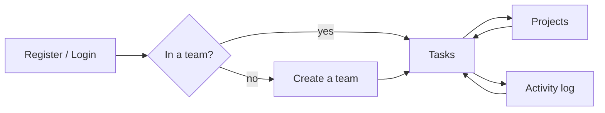
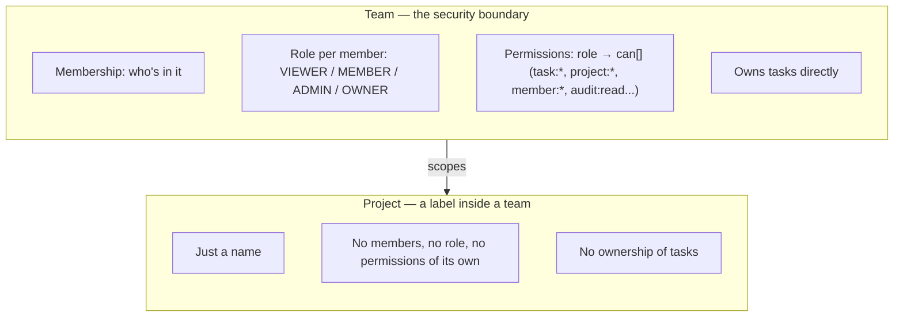

# Full-Stack Learning — Team Task Tracker

Learning project: build a secure Node + TypeScript API (Fastify, Postgres/Prisma) with
hand-written auth and RBAC, deployed for real. See [MISSION.md](./MISSION.md) for the
why and [PLAN.md](./PLAN.md) for the week-by-week plan.

- `lessons/` — self-contained lesson pages (code lives in the lesson, not in `web/`/`server/`)
- `server/`, `web/` — the app itself
- `learning-records/` — notes on decisions made along the way
- `NOTES.md` / `RESOURCES.md` — scratch notes and reference links

## Using the app

Sign in (or register), and you land in your first team's **Tasks** view — the
app's home screen. From the sidebar you can also open **Projects** (group
tasks) and **Activity** (an audit log of what changed). No team yet? You'll
see a prompt to create one.

## Teams vs. Projects

| | **Team** | **Project** |
|---|---|---|
| What it holds | members + roles | a name |
| Grants permissions? | yes — `can[]` drives every button | no — inherits whatever the team says |
| Owns tasks? | yes, tasks belong to the team | no — explicitly not a container |
| Can you delete/leave it? | yes (`team:delete`, `member:leave`) with server-side guards (e.g. can't leave as last OWNER) | only create/delete, gated by `project:create`/`project:delete` |
| Analogy | the org/workspace | a tag you can attach conceptually, not structurally |

A Team is where identity and access control live; a Project is a lightweight
label scoped under a team, with no members or permissions of its own — tasks
stay attached to the team either way.
